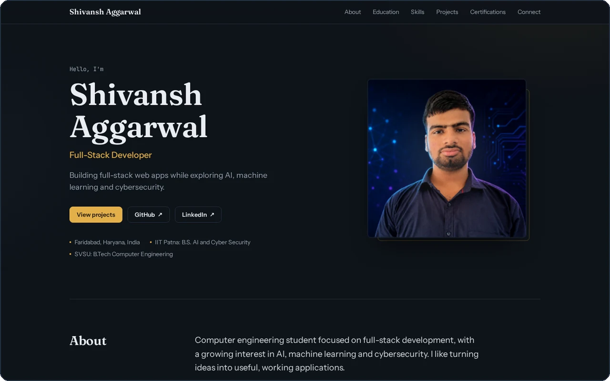
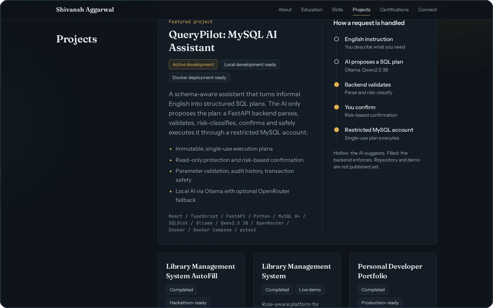
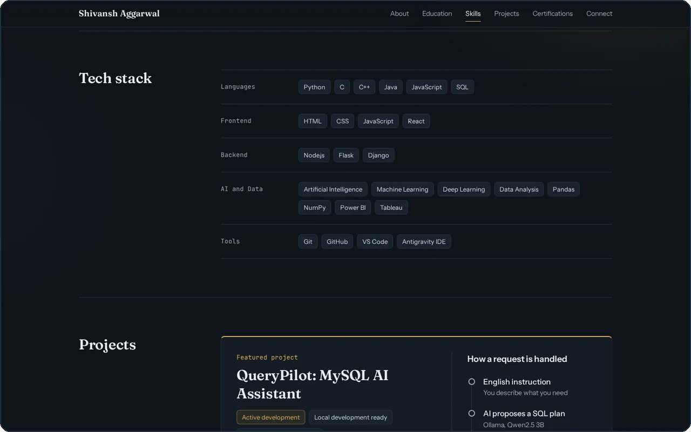
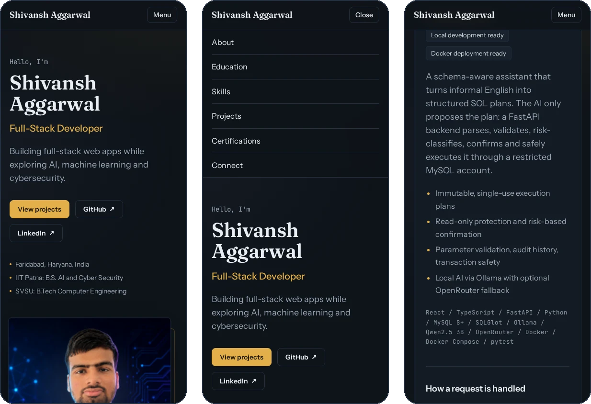

<div align="center">



<br><br>

# Shivansh Aggarwal

**A personal developer portfolio built with React 19, TypeScript and Tailwind CSS v4.**
Clean editorial design, one warm accent colour, and motion only where it helps.

<br>


<!-- Add your live site here once it is deployed, for example:
[**View live site**](https://your-site.vercel.app) -->

[Preview](#preview) &nbsp;·&nbsp; [Highlights](#highlights) &nbsp;·&nbsp; [Quick start](#quick-start) &nbsp;·&nbsp; [Customise](#customise-it) &nbsp;·&nbsp; [Deploy](#deploy) &nbsp;·&nbsp; [Contact](#contact)

</div>

---

## Preview

<p align="center">
  
</p>

<p align="center">
  
</p>

<p align="center">
  
</p>

<p align="center"><sub>Desktop and mobile layouts. The mobile version has its own navigation menu, not a shrunken desktop bar.</sub></p>

---

## Highlights

| | |
|---|---|
| **Editorial layout** | Section titles sit in a sticky left column while the content scrolls on the right. Only the projects and stat tiles are cards; everything else is ruled lists. |
| **Tilting 3D portrait** | The hero photo follows the pointer with a gentle tilt, an offset frame behind it and a soft light reflection. Built with Motion springs, no 3D library. |
| **Featured project story** | QueryPilot gets a full-width panel with a step-by-step view of how a request is handled, showing which steps the AI suggests and which the backend enforces. |
| **Considered typography** | Fraunces for headings, Instrument Sans for text and JetBrains Mono for small labels. All three are bundled with Fontsource, so there are no requests to external font servers. |
| **One content file** | Every name, link, project, skill and certification lives in a single typed file, [`src/data.ts`](src/data.ts). Edit it and the whole site updates. |
| **Accessible by default** | Skip-to-content link, visible keyboard focus, semantic landmarks, descriptive alt text, a labelled mobile menu that closes with `Esc`, and animations that switch off for visitors who prefer reduced motion. |
| **Light on the browser** | No UI framework and no animation-heavy libraries beyond Motion. The production bundle is about 369 kB of JavaScript (117 kB gzipped) and 30 kB of CSS (8.5 kB gzipped). |

---

## Sections

1. **Hero** with name, title, tagline, calls to action and the 3D portrait
2. **About** with summary, current learning, interests and goal
3. **Education** in a ruled list, IIT Patna first
4. **Tech stack** grouped into Languages, Frontend, Backend, AI and Data, and Tools
5. **Projects** with one featured project and three supporting cards, each with real GitHub and live demo links where they exist
6. **Certifications** with direct credential links, plus GitHub statistics
7. **Connect** with GitHub, LinkedIn and email

---

## Tech stack

| Layer | Choice |
|---|---|
| UI library | React 19 |
| Language | TypeScript |
| Build tool | Vite 8 with `@vitejs/plugin-react` |
| Styling | Tailwind CSS v4 through `@tailwindcss/vite`, with design tokens in `@theme` |
| Animation | Motion (`motion/react`) |
| Fonts | Fontsource variable fonts: Fraunces, Instrument Sans, JetBrains Mono |

---

## Quick start

You need **Node.js 20.19 or newer** (22.12+ also works).

```bash
# 1. Clone the repository
git clone https://github.com/Shiavsnhfbd123/<your-repo-name>.git
cd <your-repo-name>

# 2. Install dependencies
npm install

# 3. Start the dev server
npm run dev
```

Then open the local address that Vite prints, usually `http://localhost:5173`.

| Command | What it does |
|---|---|
| `npm run dev` | Starts the dev server with hot reload |
| `npm run build` | Type-checks with `tsc`, then builds to `dist/` |
| `npm run preview` | Serves the production build locally |

---

## Customise it

Almost everything is a one-line change.

| To change | Edit |
|---|---|
| Name, title, tagline, summary, links, email | `profile` in [`src/data.ts`](src/data.ts) |
| Education | `education` in [`src/data.ts`](src/data.ts) |
| Skills and groups | `skills` in [`src/data.ts`](src/data.ts) |
| Projects | `featured`, `featuredPoints`, `pipeline` and `projects` in [`src/data.ts`](src/data.ts) |
| Certifications | `certs` in [`src/data.ts`](src/data.ts) |
| GitHub numbers | `stats` in [`src/data.ts`](src/data.ts) (entered by hand) |
| Colours | the `@theme` block in [`src/index.css`](src/index.css) |
| Fonts | imports in [`src/main.tsx`](src/main.tsx) and `--font-*` in [`src/index.css`](src/index.css) |
| Portrait | replace [`public/id.jpg`](public/id.jpg) with a square image |
| Page title and social preview text | [`index.html`](index.html) |

### Colour palette

| Role | Hex | Swatch |
|---|---|---|
| Page background | `#0e1319` |  |
| Card surface | `#141b24` |  |
| Raised surface | `#19222d` |  |
| Borders and dividers | `#243040` |  |
| Body text | `#e9edf2` |  |
| Muted text | `#9aa7b6` |  |
| Accent (buttons, active links) | `#e3b04b` |  |

<details>
<summary><b>Project structure</b></summary>

```text
.
├── index.html            Page title, description and social preview tags
├── vite.config.ts        Vite with the React and Tailwind plugins
├── tsconfig.json
├── package.json
├── public/
│   └── id.jpg            Portrait used in the hero
└── src/
    ├── main.tsx          Entry point, fonts and reduced-motion setup
    ├── App.tsx           Header, sections and reusable UI pieces
    ├── PhotoCard3D.tsx   Pointer-driven tilting portrait
    ├── data.ts           All site content, typed
    ├── index.css         Tailwind import and design tokens
    └── vite-env.d.ts
```

</details>

---

## Deploy

The site builds to plain static files, so any static host works. On **Vercel**:

1. Push this repository to GitHub.
2. In Vercel choose **Add New → Project** and import the repository.
3. Keep the **Vite** framework preset (build command `npm run build`, output directory `dist`).
4. Click **Deploy**.

Once it is live, add the URL to the placeholder near the top of this README and to your GitHub profile.

---

## Contact

<p>
  <a href="https://github.com/Shiavsnhfbd123"><b>GitHub</b></a> &nbsp;·&nbsp;
  <a href="https://www.linkedin.com/in/shivanshhr123"><b>LinkedIn</b></a> &nbsp;·&nbsp;
  <a href="mailto:Shivanshfbd123@gmail.com"><b>Email</b></a>
</p>

<sub>Built by Shivansh Aggarwal, Faridabad, India. Package license: ISC, as declared in `package.json`.</sub>
# Portfolio-2

